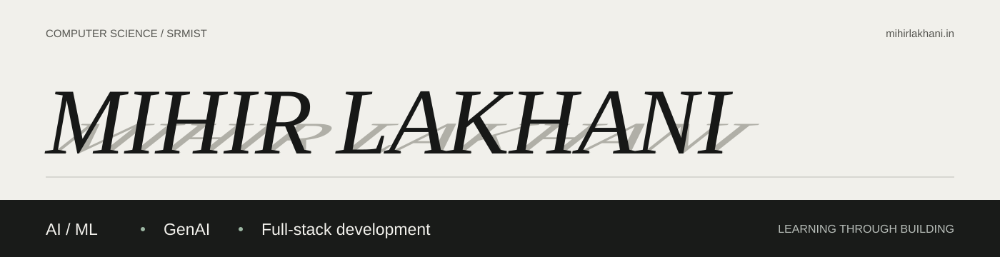

I'm a Computer Science student at **SRMIST**, building toward full-stack AI/ML engineering. I enjoy taking a project from the model or retrieval pipeline to an API and an interface people can actually use.

My current focus is **GenAI and RAG**, alongside learning how to deploy, evaluate, and maintain AI applications. My work includes academic ML experiments, a deployed portfolio assistant, and full-stack prototypes.

**[Explore my portfolio and ask about my work](https://mihirlakhani.in/)**

## Skills & Tools

- **AI / ML:** Python, machine learning, model evaluation, RAG, BM25, Ollama, Gemini API
- **Application development:** Flask, REST APIs, React, TypeScript, HTML, CSS
- **Data & deployment:** SQL, MongoDB, Docker, AWS, Git

## Featured Projects

### Source-Cited RAG Assistant
An assistant built around curated documentation from my own projects. It combines BM25 search with local embeddings through Ollama, uses Gemini to answer from selected evidence, and validates citations before returning a response. Unsupported and private-information requests are declined.

[Try it on my portfolio](https://mihirlakhani.in/) · [Code](https://github.com/Mihir-Lakhani/Mihir-portfolio)

### 5G Handover with Stability-Aware ML
An academic ML and simulation project exploring how recent network KPI history can support earlier, more stable handover recommendations. It connects offline model training, a Flask inference API, and an interactive browser simulation. It does not control a live cellular network.

[Explore the simulation](https://mihirlakhani.in/mobility) · [Code](https://github.com/Mihir-Lakhani/5G-Handover-Stability-Aware-ML)

### Fleet Smart Vehicle Digital Twin
A vehicle-record management prototype with a React/TypeScript interface, Flask REST API, and MongoDB. A separate Python desktop controller explores Arduino-based hardware interaction. The project is a learning prototype, not a production fleet platform.

[Code](https://github.com/Mihir-Lakhani/fleet-digital-twin-eclipse-ditto)

---

[Portfolio](https://mihirlakhani.in/) · [LinkedIn](https://www.linkedin.com/in/mihir-lakhani-149504327/)
